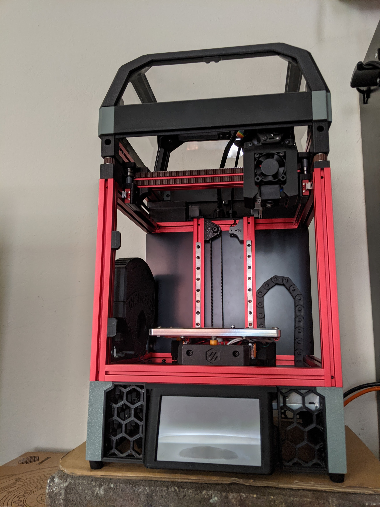
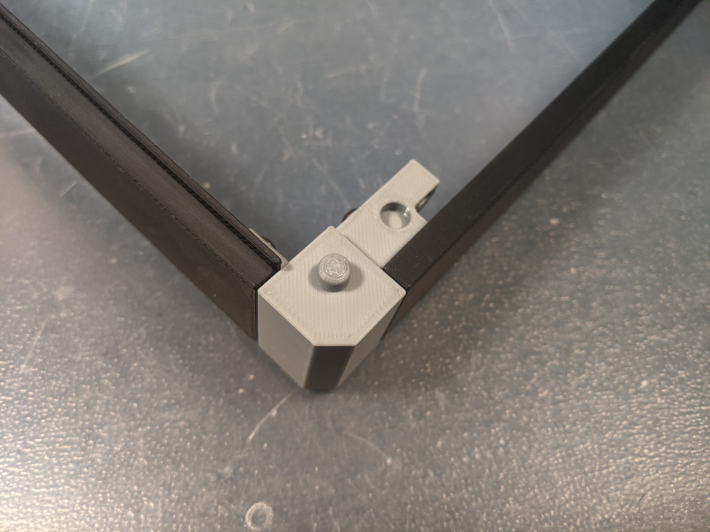
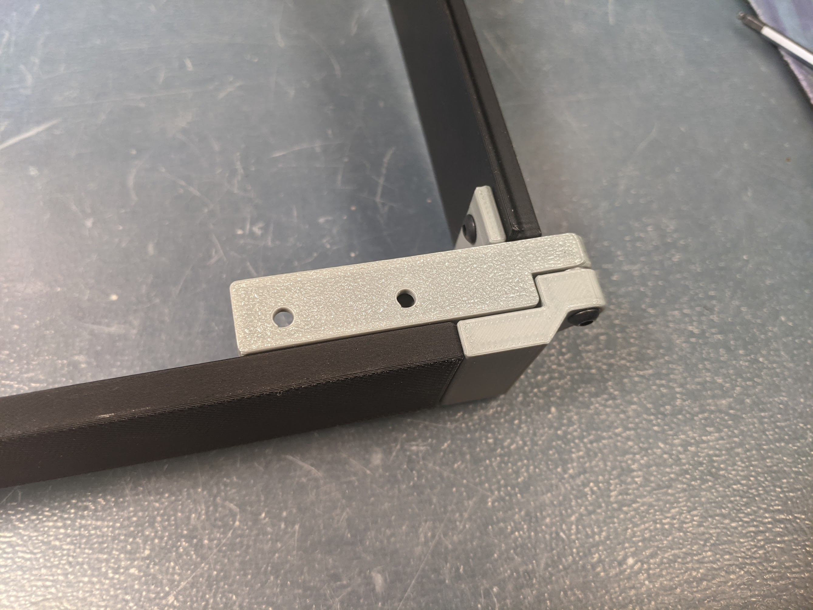
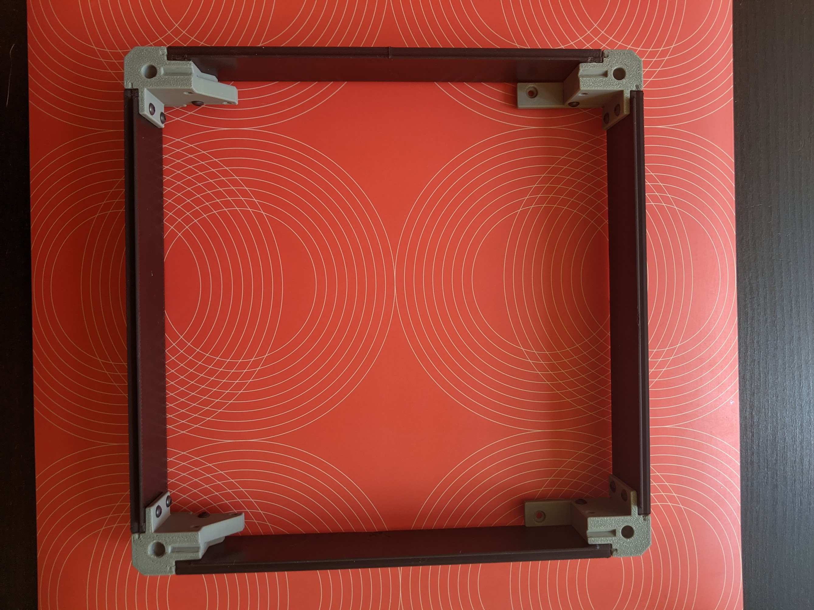
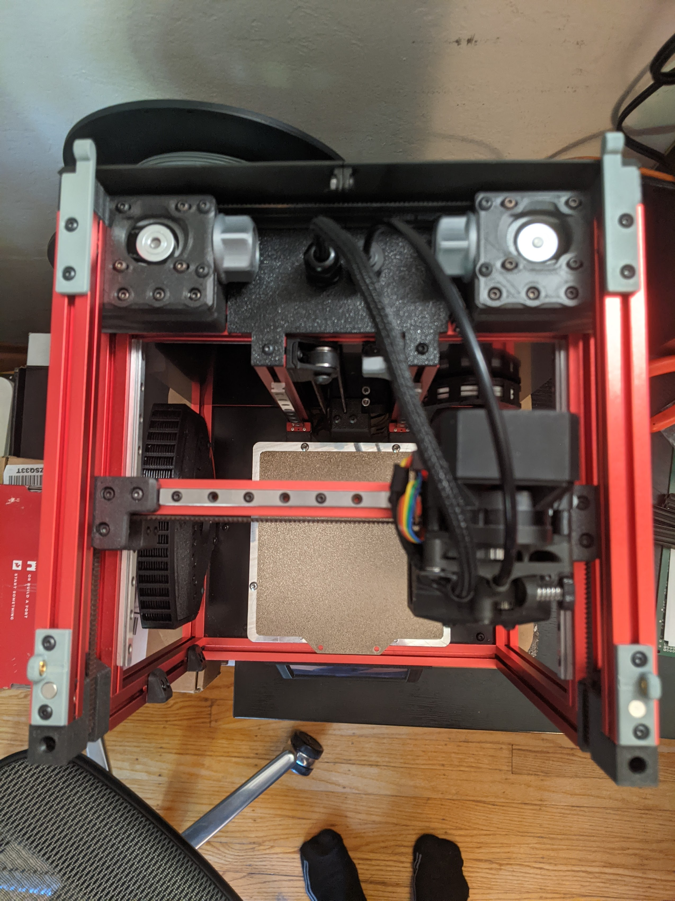

# Hinged Tophat Riser

This riser is based on TheFPVGeek's original 15mm tophat riser (https://github.com/theFPVgeek/VoronUsers/tree/master/printer_mods/theFPVgeek/v0-tophat-extention), with improved QoL features:
- hinges
- magnetic latches
- optional screw locks

It was created to solve one specific problem when using a Sherpa Mini extruder with a tophat: clearance to the electronics cable and bowden tube, so they can clear the top panel of the tophat in all positions.  

It also looks nice and gives a location to mount any LEDs or nametags you might want.

Assembly and printing should be relatively straightforward.  Notes:
- Panels can be printed at lower infill (~16-25%)
- Put an M3 spacer between the hinge halves on each side for smooth motion

TODO: update and add precision to the BOM

Parts you'll need:
- many M3 x 6 BHCS
- additional M3 BHCS of varying length
- 2x M3 0.5mm shims
- 4x 6mm x 3mm disc magnets (same as with V0)

You'll need a lot of M3 heatset inserts and small m3 screws to build this, but the magnetic attach is super-smooth, and it's worth it.

